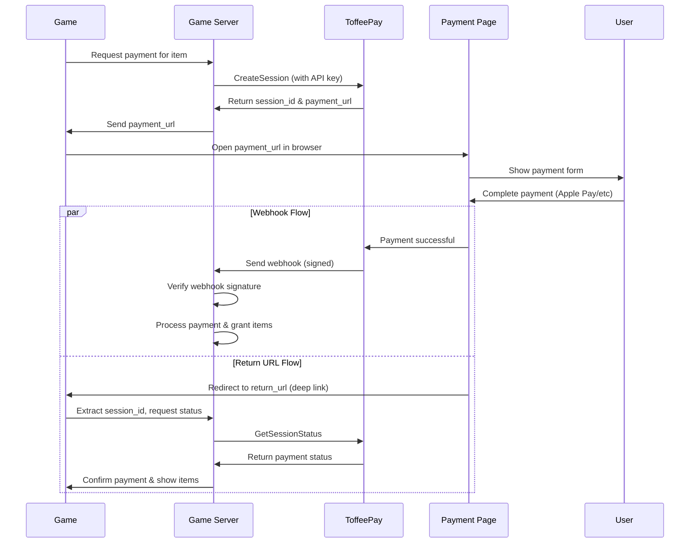

# Getting Started

This guide walks you through:
1. Authentication
2. Creating a payment session
3. Opening the payment page
4. Handling payment confirmation via webhook
5. Resuming the game using `return_url`

## Payment Flow



---

## Authentication

All requests to the ToffeePay API must include your API key:

```http
Authorization: Bearer <your_api_key>
```

You’ll receive this key when you register your game. Keep it secret and **only use it server-side**.

---

## Create a Payment Session

Send a server-side request to create a payment session.

```http
POST /pay.v1.PaymentService/CreateSession
Authorization: Bearer <your_api_key>
Content-Type: application/json

{
  "game_id": "space_shooter",
  "user_id": "player_42",
  "item": {
    "title": "50 Gold Coins",
    "price": 499,
    "currency": "USD",
    "image": "data:image/png;base64,..."
  },
  "return_url": "mygame://payment-complete"
}
```

**Response**

```json
{
  "session_id": "sess_abc123",
  "payment_url": "https://pay.toffeepay.com/sess_abc123"
}
```

---

## Open the Payment Page

Open the returned `payment_url` in the browser.

The user will:
- View the list of items and total price
- Pay using Apple Pay or another supported method

---

## Handle Payment Webhook (optional)

Once payment is successful, ToffeePay sends a **signed webhook** to your backend.

**Sample Payload:**
```json
{
  "session_id": "sess_abc123",
  "user_id": "player_42",
  "game_id": "space_shooter",
  "status": "paid",
  "item": { "title": "50 Gold Coins", "price": 499, "currency": "USD" }
}
```

**Header:**
```
X-ToffeePay-Signature: t=1717000000,v1=6aeedfabc12345...
```

### Verifying the webhook

1. Parse `t` and `v1` from the signature header.
2. Compute:
   ```
   signed_payload = t + "." + raw_body
   expected_signature = HMAC_SHA256(your_webhook_secret, signed_payload)
   ```
3. Validate that `t` is within 5 minutes.
4. Use a constant-time comparison to compare signatures.

You can **configure or rotate your webhook secret** in the ToffeePay dashboard.

---

## Return to Game (return_url)

After a successful payment, the player is **redirected to your specified `return_url`**.

This is typically a **custom deep link** that your game handles to:
- Show a success screen
- Confirm the session was paid

**Example:**
```json
"return_url": "mygame://payment-complete?session_id=sess_abc123"
```

Make sure your mobile client is set up to **handle and parse this URI scheme**.

---

### Confirming Payment

To confirm the payment status after returning to the game:

1. Extract `session_id` from the URL.
2. Call `GetSessionStatus` using your API key.

**Example Request:**
```http
POST /pay.v1.PaymentService/GetSessionStatus
Authorization: Bearer <your_api_key>
Content-Type: application/json

{
  "session_id": "sess_abc123"
}
```

**Example Response:**
```json
{
  "session_id": "sess_abc123",
  "status": "paid"
}
```

- If `status` is `paid`, grant the items or show success.
- If `status` is `pending`, show a waiting screen.
- If `status` is `failed` or `cancelled`, inform the user.

## Image Requirements

- Format: PNG, JPG, WebP
- Recommended size: ≤ 300 KB
- Must be base64-encoded with MIME prefix:
  ```
  data:image/png;base64,...
  ```
  or URL
  ```
  https://...
  ```
