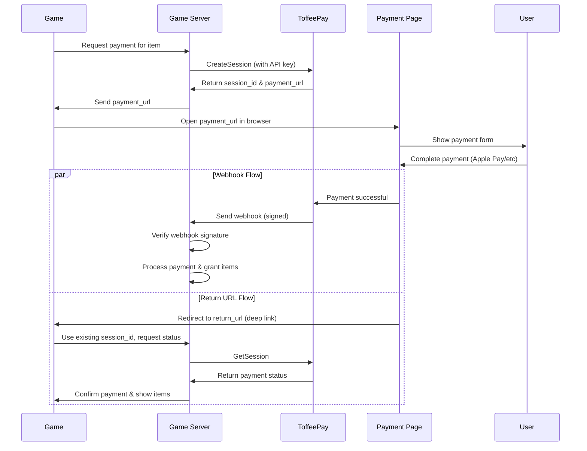

# Payments

This guide covers the complete payment flow in ToffeePay, from creating payment sessions to handling confirmations.

## Payment Flow



---

## Create a Payment Session

Send a server-side request to create a payment session.

```http
POST /pay.v1.PaymentService/CreateSession
Authorization: Bearer <your_api_key>
Content-Type: application/json

{
  "game_id": "space_shooter",
  "user_id": "player_42",
  "item": {
    "title": "50 Gold Coins",
    "price": 499,
    "currency": "USD",
    "image": "data:image/png;base64,..."
  },
  "return_url": "mygame://payment-complete"
}
```

**Parameters:**
- `game_id`: Your unique game identifier
- `user_id`: Unique identifier for the player
- `item`: The item being purchased
  - `title`: Display name of the item
  - `price`: Price in cents (e.g., 499 = $4.99)
  - `currency`: Three-letter currency code (USD, EUR, etc.)
  - `image`: Base64-encoded image or URL
- `return_url`: Deep link to return to after payment

**Response**

```json
{
  "id": "sess_abc123",
  "url": "https://pay.toffeepay.com/sess_abc123"
}
```

---

## Payment Statuses

Payment sessions can have the following statuses:

- `pending`: Payment session created but not yet paid
- `paid`: Payment successfully completed
- `failed`: Payment attempt failed
- `cancelled`: Payment was cancelled by the user
- `expired`: Payment session has expired

---

## Webhook Events

ToffeePay sends webhooks for the following payment-related events:

### Session Events
- `session.created`: When a payment session is created
- `session.paid`: When a session is successfully paid
- `session.failed`: When payment attempt related to this session fails
- `session.expired`: When a session expires without payment
- `session.cancelled`: When session is cancelled by user

### Payment Events
- `payment.processing`: When payment is being processed (for async methods)
- `payment.succeeded`: When payment completes successfully
- `payment.failed`: When payment attempt fails

See the [Webhooks](/webhooks) page for implementation details and signature verification.

---

## Open the Payment Page

Open the returned `payment_url` in the browser or webview.

The user will:
- View the item details and total price
- Pay using Apple Pay, Google Pay, or other supported methods
- Be redirected back to your game via the `return_url`

---

## Handle Payment Notifications

ToffeePay notifies you of payment events through two methods:

### 1. Webhooks

When a payment is completed, ToffeePay sends a signed webhook to your backend. See the [Webhooks](/webhooks) page for detailed implementation.

**Sample Payload:**
```json
{
  "id": "550e8400-e29b-41d4-a716-446655440000",
  "event": "payment.succeeded",
  "timestamp": "2023-06-01T12:05:00Z",
  "data": {
    "payment_id": "pay_xyz789"
  }
}
```

### 2. Return URL

After payment, the user is redirected to your specified `return_url`. This is typically a custom deep link that your game handles.

**Example:**
```json
"return_url": "mygame://payment-complete"
```

---

## Check Session Status

To confirm session status (especially when handling return URLs), you can use either endpoint:

### GetSession (Full Details)

```http
POST /pay.v1.PaymentService/GetSession
Authorization: Bearer <your_api_key>
Content-Type: application/json

{
  "id": "sess_abc123"
}
```

**Response:**
```json
{
  "id": "sess_abc123",
  "status": "paid",
  "payment_id": "pay_xyz789",
  "user_id": "player_42",
  "game_id": "space_shooter",
  "item": {
    "title": "50 Gold Coins",
    "price": 499,
    "currency": "USD"
  },
  "created_at": "2023-06-01T12:00:00Z",
  "paid_at": "2023-06-01T12:05:00Z"
}
```

### GetSessionStatus (Status Only)

```http
POST /pay.v1.PaymentService/GetSessionStatus
Authorization: Bearer <your_api_key>
Content-Type: application/json

{
  "id": "sess_abc123"
}
```

**Response:**
```json
{
  "id": "sess_abc123",
  "status": "paid"
}
```

**Status handling:**
- If `status` is `paid`, grant the items and show success
- If `status` is `pending`, show a waiting screen
- If `status` is `failed`, `cancelled` or `expired`, inform the user and offer to retry

---

## Get Payment Details

Retrieve details of a payment:

```http
POST /pay.v1.PaymentService/GetPayment
Authorization: Bearer <your_api_key>
Content-Type: application/json

{
  "id": "pay_xyz789"
}
```

**Response:**
```json
{
  "id": "pay_xyz789",
  "session_id": "sess_abc123",
  "status": "succeeded",
  "amount": 499,
  "currency": "USD",
  "method": "apple_pay",
  "details": "50 Gold Coins",
  "created_at": "2023-06-01T12:05:00Z",
  "succeeded_at": "2023-06-01T12:05:30Z"
}
```

---

## List Sessions

Retrieve historical sessions for audit and analytics:

```http
POST /pay.v1.PaymentService/ListSessions
Authorization: Bearer <your_api_key>
Content-Type: application/json

{
  "game_id": "space_shooter",
  "user_id": "player_42",
  "status": "paid",
  "limit": 50,
  "offset": 0
}
```

**Response:**
```json
{
  "sessions": [
    {
      "id": "sess_abc123",
      "status": "paid",
      "payment_id": "pay_xyz789",
      "user_id": "player_42",
      "game_id": "space_shooter",
      "item": {
        "title": "50 Gold Coins",
        "price": 499,
        "currency": "USD"
      },
      "created_at": "2023-06-01T12:00:00Z",
      "paid_at": "2023-06-01T12:05:00Z"
    }
  ],
  "total": 1,
  "has_more": false
}
```

---

## List Payments

Retrieve historical payments (successful transactions only):

```http
POST /pay.v1.PaymentService/ListPayments
Authorization: Bearer <your_api_key>
Content-Type: application/json

{
  "game_id": "space_shooter",
  "user_id": "player_42",
  "limit": 50,
  "offset": 0
}
```

**Response:**
```json
{
  "payments": [
    {
      "id": "pay_xyz789",
      "session_id": "sess_abc123",
      "status": "succeeded",
      "amount": 499,
      "currency": "USD",
      "method": "apple_pay",
      "details": "50 Gold Coins",
      "created_at": "2023-06-01T12:05:00Z",
      "succeeded_at": "2023-06-01T12:05:30Z"
    }
  ],
  "total": 1,
  "has_more": false
}
```

---

## Image Requirements

Item images must meet these requirements:

- **Format**: PNG, JPG, WebP
- **Size**: ≤ 300 KB recommended
- **Encoding**: Base64 with MIME prefix or direct URL

**Base64 format:**
```
data:image/png;base64,iVBORw0KGgoAAAANSUhEUgAA...
```

**URL format:**
```
https://yourgame.com/images/gold-coins.png
```

---

## Best Practices

1. **Authentication**: See [Authentication](/authentication) for API key management
2. **Webhook verification**: Always verify webhook signatures (see [Webhooks](/webhooks))
3. **Error handling**: Implement proper error handling for all payment statuses
4. **User experience**: Show loading states and clear success/failure messages
5. **Security**: Use HTTPS for all webhook endpoints and return URLs
6. **Testing**: Use sandbox mode for development and testing

---

## Error Handling

Common payment errors and how to handle them:

- `invalid_game_id`: Check your game registration and API key (see [Authentication](/authentication))
- `invalid_currency`: Ensure currency code is supported (USD, EUR, etc.)
- `invalid_price`: Price must be a positive integer in cents
- `invalid_image`: Check image format and size requirements
- `session_expired`: Payment session has expired, create a new one
- `insufficient_funds`: User's payment method was declined

---

## Testing

Use ToffeePay's sandbox environment for testing:

1. Use sandbox API keys (different from production)
2. Test with various payment methods and failure scenarios
3. Verify webhook delivery and signature verification
4. Test return URL handling in your game client