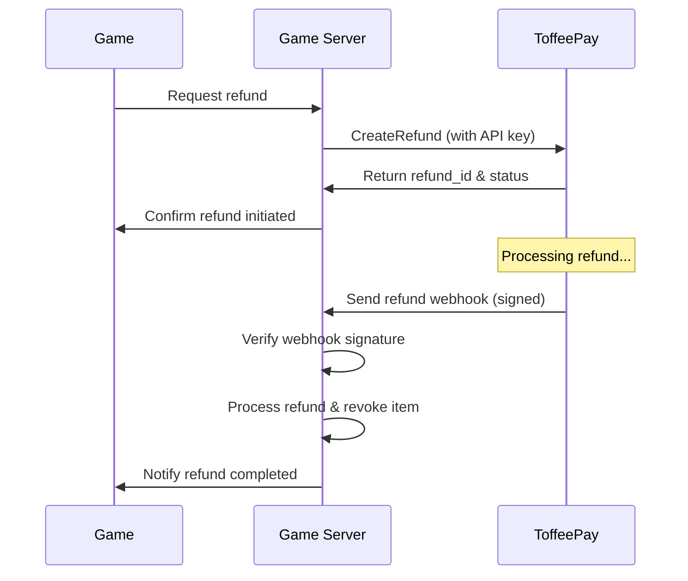

# Refunds

This guide covers how to handle refunds in ToffeePay, including initiating refunds and handling refund webhooks.

## Refund Flow



---

## Create a Refund

Send a server-side request to initiate a refund for a paid session.

```http
POST /pay.v1.RefundService/CreateRefund
Authorization: Bearer <your_api_key>
Content-Type: application/json

{
  "payment_id": "pay_xyz789",
  "reason": "Customer request"
}
```

**Parameters:**
- `payment_id`: The original payment ID to refund
- `reason`: Optional reason for the refund

**Response**

```json
{
  "id": "ref_xyz789"
}
```

---

## Refund Statuses

Refunds can have the following statuses:

- `pending`: Refund created but not yet processed
- `succeeded`: Refund has been successfully processed and funds returned
- `failed`: Refund failed (e.g., insufficient funds, payment method issues)
- `cancelled`: Refund was cancelled before completion

**Status Flow:**
1. Refund starts as `pending`
2. Refund resolves to either `succeeded`, `failed`, or `cancelled`

### Timestamp Fields

Refunds include relevant timestamp fields based on their final status:

- `created_at`: When the refund was initiated
- `succeeded_at`: When the refund completed successfully (if applicable)
- `failed_at`: When the refund failed (if applicable)
- `cancelled_at`: When the refund was cancelled (if applicable)

---

## Webhook Events

ToffeePay sends webhooks for the following refund-related events:

### Refund Events
- `refund.created`: When a refund is created and processing begins
- `refund.succeeded`: When a refund has been processed successfully
- `refund.failed`: When a refund attempt fails
- `refund.cancelled`: When a refund is cancelled

See the [Webhooks](/webhooks) page for implementation details and signature verification.

---

## Handle Refund Notifications

When a refund is processed, ToffeePay sends a **signed webhook** to your backend.

**Sample Payload:**
```json
{
  "id": "6ba7b810-9dad-11d1-80b4-00c04fd430c8",
  "event": "refund.succeeded",
  "timestamp": "2023-06-01T12:10:00Z",
  "data": {
    "refund_id": "ref_xyz789"
  }
}
```

For webhook signature verification, see the [Webhooks](/webhooks#webhook-signature-verification) page.

---

## Check Refund Status

You can check the status of a refund at any time:

```http
POST /pay.v1.RefundService/GetRefund
Authorization: Bearer <your_api_key>
Content-Type: application/json

{
  "id": "ref_xyz789"
}
```

**Response:**
```json
{
  "id": "ref_xyz789",
  "payment_id": "pay_xyz789",
  "status": "succeeded",
  "reason": "Customer request",
  "created_at": "2023-06-01T12:00:00Z",
  "succeeded_at": "2023-06-01T12:05:00Z"
}
```

---

## List Refunds

Retrieve historical refunds for audit and analytics:

```http
POST /pay.v1.RefundService/ListRefunds
Authorization: Bearer <your_api_key>
Content-Type: application/json

{
  "payment_id": "pay_xyz789",
  "status": "succeeded",
  "limit": 50,
  "offset": 0
}
```

**Parameters:**
- `payment_id` (optional): Filter refunds for a specific payment
- `status` (optional): Filter by refund status (`pending`, `succeeded`, `failed`, `cancelled`)
- `limit` (optional): Number of refunds to return (default 50)
- `offset` (optional): Number of refunds to skip for pagination

**Response:**
```json
{
  "refunds": [
    {
      "id": "ref_xyz789",
      "payment_id": "pay_xyz789",
      "status": "succeeded",
      "reason": "Customer request",
      "created_at": "2023-06-01T12:00:00Z",
      "succeeded_at": "2023-06-01T12:05:00Z"
    }
  ],
  "total": 1,
  "has_more": false
}
```

---

## Best Practices

1. **Idempotency**: Use [Idempotency-Key](/idempotency) header to prevent duplicate refunds
2. **Revoke Items**: When processing a refund webhook, ensure you revoke the purchased items from the user's account
3. **User Communication**: Keep users informed about refund status through your game's UI
4. **Audit Trail**: Log all refund requests and completions for auditing purposes
5. **Timeout Handling**: Refunds may take several business days depending on the payment method

---

## Error Handling

Common refund errors:

- `payment_not_found`: The payment doesn't exist
- `already_refunded`: Payment has already been refunded
- `refund_not_allowed`: Payment method doesn't support refunds
- `insufficient_funds`: Merchant account has insufficient funds for the refund